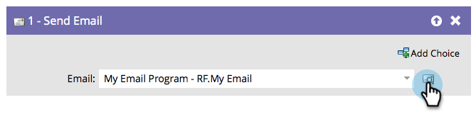

# Envoyer un e-mail {#send-email}

L’étape de flux « [!UICONTROL &#x200B; Envoyer un e-mail &#x200B;] » peut être utilisée dans le cadre de campagnes ou comme étape de flux unique pour envoyer des e-mails à vos personnes.

Vous pouvez prévisualiser l’e-mail sélectionné directement à partir de l’étape de flux.

1. Recherchez et sélectionnez l’e-mail à envoyer.

   

   >[!NOTE]
   >
   >Votre e-mail doit être approuvé si vous souhaitez le sélectionner à l’étape de flux.

1. Cliquez sur l’icône d’aperçu pour afficher l’e-mail actuellement sélectionné.

   

Un nouvel onglet/une nouvelle fenêtre s’ouvre où vous pouvez voir l’e-mail.
