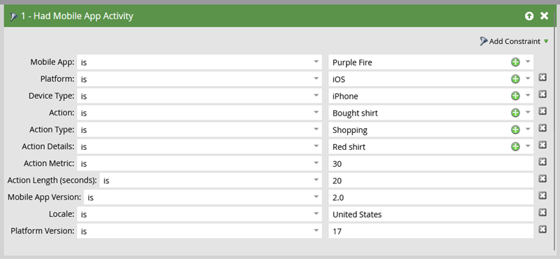

# Déclencheurs et filtres pour les campagnes dynamiques mobiles {#triggers-and-filters-for-mobile-smart-campaigns}

Vous pouvez configurer des déclencheurs et des filtres pour une campagne dynamique d’application mobile.

Pour la plupart des activités, il existe un trigger, un filtre et un filtre d’inactivité. Utilisez les filtres d’inactivité pour effectuer le suivi d’une action, comme appuyer sur une notification push, selon laquelle _ne l&#39;a pas fait_ survient.

* L’Application Mobile Est/A Été Installée
* L’application mobile est/a été ouverte
* A/A eu une activité d’application mobile
* A/A eu une session d’application mobile
* Appuyez/appuyez sur Notification push mobile.

Il n’existe que des filtres pour cette activité :

* Notification push envoyée - filtre et filtre d’inactivité

Recherchez &quot;application mobile&quot; dans le panneau de droite pour répertorier tous les déclencheurs et filtres d’applications mobiles.

## Contraintes {#constraints}

Utilisez des contraintes avec des déclencheurs et des filtres pour trier davantage les données.

Tous les déclencheurs et filtres, à l’exception de la notification push de l’envoi, contiennent les deux contraintes standard suivantes :

* Type de périphérique : iPod, iPhone, iPhone 6 Plus, iPad mini, iPad, smartphone Android, tablette Android, Inconnu (il s’agit d’une liste de paramètres prédéfinis)

* Platform - iPhone ou Android

Certains déclencheurs et filtres offrent des contraintes supplémentaires, telles que :

* Version de l’application - Un moyen de cibler les personnes qui ne disposent pas de la dernière version. Par exemple, si la dernière version de l’application est 2.0, vous pouvez l’utiliser pour rechercher les personnes qui ne sont PAS sur la version 2.0 de l’application.

* Installer la source : actuellement, la seule option est API

* Paramètre régional : paramètre défini sur l’appareil.

* Application mobile : nom de l’application spécifique. Utile pour spécifier si vous en avez plusieurs.

* Version de la plateforme : version du système d’exploitation.

* Durée de la session (secondes) : durée de la session lorsque l’application est au premier plan.

* Push activé - **True** signifie que les notifications push peuvent être envoyées. **False** signifie qu’ils ne le peuvent pas ; par exemple, la personne peut avoir choisi de ne pas recevoir de notifications push.

## Déclencheurs et filtres {#triggers-and-filters}

**Avec application mobile**

Utilisez ce filtre pour découvrir toutes les personnes qui ont déjà installé votre application. Cette option est disponible uniquement sous la forme d’un filtre.

>[!NOTE]
>
>Le filtre trouvera les installations actuelles et antérieures, car Marketo ne suit pas les désinstallations d’application.

**Contrainte** - Type d’appareil, plateforme, application mobile, version d’application mobile, type d’appareil, source d’installation, Push activé et paramètres régionaux

>[!TIP]
>
>Il est recommandé de spécifier Has Mobile App = true et Is Push Enabled = true, ainsi que le nom de votre application mobile lors de la définition de la liste dynamique de qui doit recevoir une notification push.

L’Application Mobile Est/A Été Installée

* L’application mobile est installée - déclencheur

* L’application mobile a été installée - filter

* NOT Mobile App a été installé - filtre d’inactivité

**Contrainte** - Type de périphérique, plateforme, version d’application, paramètres régionaux et source d’installation

L’application mobile est/a été ouverte

* Application mobile ouverte - déclencheur

* L’application mobile a été ouverte - filtre

* NOT Mobile App was Opening - filtre d’inactivité

**Contrainte** - Type d’appareil et plateforme

A/A eu une activité d’application mobile

Ils offrent un moyen puissant de suivre l’activité mobile personnalisée. Vous devrez collaborer avec votre développeur pour configurer le suivi. [pour Android](https://experienceleague.adobe.com/en/docs/marketo-developer/marketo/mobile/installation#how-to-install-marketo-sdk-on-android){target="_blank"} et [pour iOS](https://experienceleague.adobe.com/en/docs/marketo-developer/marketo/mobile/installation#install-marketo-sdk-on-ios){target="_blank"}.

* Avec activité d’application mobile - déclencheur

* Disposition d’une activité d’application mobile - filtre

* Activité de l’application mobile NON présente - filtre d’inactivité

**Contrainte** - Type de périphérique, plateforme, version d’application mobile, paramètres régionaux, version de plateforme, plus cinq autres éléments :

* Action - Activité mobile personnalisée

* Type d’action : champ de texte (facultatif) utilisé pour classer plusieurs actions

* Détails de l’action : champ de texte (facultatif) qui fournit des informations supplémentaires sur une action.

* Mesure d’action : champ numérique (facultatif) fournissant des informations supplémentaires sur une action (prix, par exemple)

* Durée de l’action (secondes) - (facultatif) champ numérique pouvant être utilisé pour capturer le temps nécessaire à un utilisateur pour terminer une action

Les contraintes Action vous permettent d’utiliser le déclencheur et les filtres pour suivre de très près l’activité mobile.

>[!NOTE]
>
>**Exemple**
>
>Sous le type d’action de *Magasin*, voici une action très spécifique, avec les autres contraintes qui la définissent :
>
>* Achat d&#39;une chemise
>   * C&#39;était rouge.
>   * Ça a coûté 30 dollars.
>   * Il a fallu 20 secondes pour acheter

Voici à quoi ressemble le filtre dans Marketo :

>[!NOTE]
>
>**Exemple**
>
>Vous pouvez avoir plusieurs actions sous le même type d’action. En fait, votre expérience d’achat normale peut impliquer plusieurs colonnes sous Shopping ! Que dis-tu de chaussettes avec ça ?
>
>| Type d&#39;action | Magasin | Magasin |
>|---|---|---|
>| Action | Panier | Pantalon acheté |
>| Détails de l’action | Couleur | Couleur |
>| Mesure de l’action | Prix | Prix |

**A/A eu une session d’application mobile**

* Dispose d’une session d’application mobile - trigger

* Disposition d’une session d’application mobile - filtre

* Session d’application mobile NON présente - filtre d’inactivité

**Contrainte** - Type d’appareil, plateforme et durée de session (secondes)

Notification Push Appuyée/Appuyée

* Notification push - déclencheur

* Notification push sur - filtre

* Notification push non activée - filtre d’inactivité

**Contrainte** - Type de périphérique, plateforme, version d’application mobile, notification push et version de plateforme

>[!TIP]
>
>Utilisez le filtre d’inactivité Notification push non sélectionnée pour rechercher les personnes qui n’ont pas appuyé sur une notification push récemment envoyée, afin que vous puissiez effectuer un suivi par courrier électronique.

**Envoi d’une notification push** Cette activité est disponible uniquement sous forme de filtre.

* Notification push envoyée - filtre

* Notification push NON envoyée - filtre d’inactivité

**Contrainte** - Notification push et application mobile

>[!MORELIKETHIS]
>
>* [Ajout d’une contrainte à un filtre de liste dynamique](/help/marketo/product-docs/core-marketo-concepts/smart-lists-and-static-lists/using-smart-lists/add-a-constraint-to-a-smart-list-filter.md){target="_blank"}
>* [Utilisation des filtres d’inactivité dans une liste dynamique](/help/marketo/product-docs/core-marketo-concepts/smart-lists-and-static-lists/using-smart-lists/use-inactivity-filters-in-a-smart-list.md){target="_blank"}
