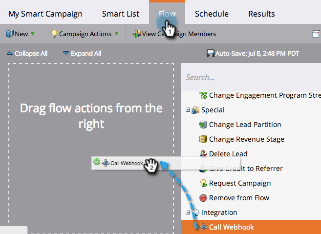

# Utiliser Webhook dans une Campaign intelligente {#use-a-webhook-in-a-smart-campaign}

Pour utiliser un [webhook](http://developers.marketo.com/documentation/webhooks/), ajoutez-le à une [campagne intelligente](/help/marketo/product-docs/core-marketo-concepts/smart-campaigns/flow-actions/add-a-flow-step-to-a-smart-campaign.md) en tant qu’action de flux.

>[!AVAILABILITY]
>
>Tous les clients n’ont pas acheté cette fonctionnalité. Contactez votre représentant commercial pour plus de détails.

1. [Créez une campagne](/help/marketo/product-docs/core-marketo-concepts/smart-campaigns/creating-a-smart-campaign/create-a-new-smart-campaign.md) intelligente.

   >[!NOTE]
   >
   >Les hameçons Web ne peuvent être utilisés que dans les campagnes de déclenchement.

1. Accédez à l&#39;onglet **Flux** et faites glisser l&#39;élément **Appeler Webhook** de l&#39;action de flux.

   

1. Sélectionnez le crochet Web.

   

1. Vous pouvez également utiliser des hameçons Web dans une liste intelligente.

   

1. Enfin, vous pouvez utiliser des crochets Web dans **Ajouter Choix** dans une étape de flux.

   
