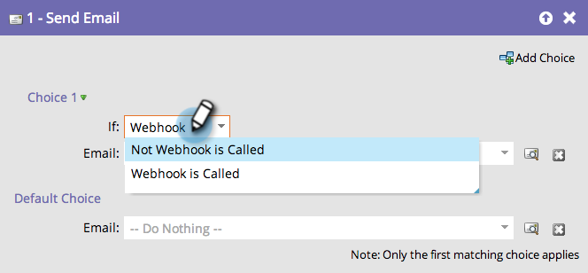

# Utiliser un webhook dans une campagne intelligente {#use-a-webhook-in-a-smart-campaign}

Pour utiliser un [webhook](https://experienceleague.adobe.com/fr/docs/marketo-developer/marketo/webhooks/webhooks){target="_blank"}, ajoutez-le à une [campagne intelligente](/help/marketo/product-docs/core-marketo-concepts/smart-campaigns/flow-actions/add-a-flow-step-to-a-smart-campaign.md){target="_blank"} en tant qu’action de flux.

>[!AVAILABILITY]
>
>Tous les utilisateurs de Marketo Engage n’ont pas acheté cette fonctionnalité. Pour plus d’informations, contactez l’équipe du compte Adobe (votre gestionnaire de compte).

1. [Créer une campagne intelligente](/help/marketo/product-docs/core-marketo-concepts/smart-campaigns/creating-a-smart-campaign/create-a-new-smart-campaign.md){target="_blank"}.

   >[!NOTE]
   >
   >Les Webhooks ne peuvent être utilisés que dans les campagnes Trigger.

1. Accédez à l’onglet **[!UICONTROL Flux]** et faites glisser l’action de flux **[!UICONTROL Appeler le Webhook]**.

   

1. Sélectionnez le **[!UICONTROL Webhook]**.

   

1. Vous pouvez également utiliser des Webhooks dans une liste dynamique.

   

1. Enfin, vous pouvez utiliser des Webhooks dans **[!UICONTROL Ajouter un choix]** lors d’une étape de flux.

   
