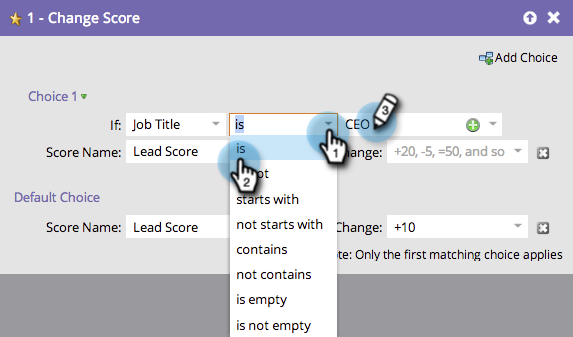

# Utiliser l’option Ajouter un choix dans une étape de flux {#use-add-choice-in-a-flow-step}

>[!PREREQUISITES]
>
>[Ajouter une étape de flux à une campagne dynamique](/help/marketo/product-docs/core-marketo-concepts/smart-campaigns/flow-actions/add-a-flow-step-to-a-smart-campaign.md){target="_blank"}

« Ajouter le choix » vous permet d’utiliser une étape de flux et de dire « ça dépend » lorsque vous choisissez les détails.

1. Sous l’onglet **[!UICONTROL Flux]** de la campagne dynamique, ajoutez une étape de flux, puis cliquez sur **[!UICONTROL Ajouter un choix]**.

   

1. Sélectionnez la condition de choix.

   

1. Choisissez l’opérateur de choix et saisissez une valeur de choix. Cela définit vos critères ou votre choix.

   

1. Saisissez une valeur d’étape de flux pour le choix.

   

   >[!CAUTION]
   >
   >Les jetons ne fonctionnent _pas_ dans la partie de condition d’une étape de flux de choix.

1. Répétez les étapes ci-dessus pour ajouter plusieurs choix, puis ajoutez/ajustez la valeur par défaut.

   

   >[!TIP]
   >
   >Vous pouvez définir l’une de vos étapes de flux sur —Ne rien faire—, auquel cas aucune action ne sera entreprise concernant ce choix.

   >[!CAUTION]
   >
   >Seul le premier choix correspondant est appliqué à l’étape de flux. Découvrez comment [réorganiser « Ajouter un choix » dans une action de flux](/help/marketo/product-docs/core-marketo-concepts/smart-campaigns/flow-actions/reorder-add-choice-in-a-flow-step.md){target="_blank"}.

   Fantastique ! Vous pouvez désormais créer une seule campagne dynamique avec des choix d’étapes de flux au lieu de créer plusieurs campagnes dynamiques pour chaque choix.

   >[!MORELIKETHIS]
   >
   >[Réorganiser l’ajout d’un choix dans une étape de flux](/help/marketo/product-docs/core-marketo-concepts/smart-campaigns/flow-actions/reorder-add-choice-in-a-flow-step.md){target="_blank"}
