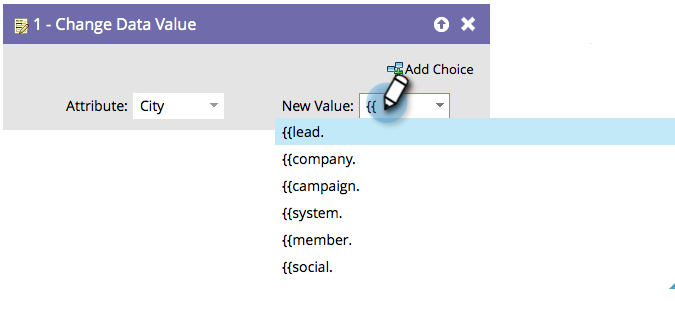

# Utilisation de jetons dans les étapes de flux {#use-tokens-in-flow-steps}

>[!PREREQUISITES]
>
>[Ajout d’une étape de flux à une campagne dynamique](/help/marketo/product-docs/core-marketo-concepts/smart-campaigns/flow-actions/add-a-flow-step-to-a-smart-campaign.md){target="_blank"}

Un jeton est une variable. Vous l’utilisez dans les emails, les pages d’entrée et les campagnes intelligentes pour faciliter votre vie. Vous pouvez utiliser [Mes jetons](/help/marketo/product-docs/core-marketo-concepts/programs/tokens/understanding-my-tokens-in-a-program.md){target="_blank"} (jetons personnalisés) dans les étapes de flux, webhooks, emails et landing pages. Vous pouvez utiliser des jetons pour inclure du contenu variable dans ces étapes de flux :

* Modifier la valeur des données
* Modifier les données du membre du programme
* Moment intéressant
* Étapes de campagne Salesforce (ajout, suppression, modification de l’état)
* Créer une tâche
* Envoyer une alerte (dans Campagnes de déclenchement uniquement)

1. À l’étape du flux, commencez à saisir `{{` pour obtenir les catégories de jeton.

   

   >[!NOTE]
   >
   >Consultez [Présentation des jetons](/help/marketo/product-docs/demand-generation/landing-pages/personalizing-landing-pages/tokens-overview.md){target="_blank"} pour obtenir la liste de plusieurs jetons disponibles.

1. Continuez à taper jusqu’à ce que vous trouviez le jeton de votre choix, puis cliquez pour le sélectionner.

   

   >[!TIP]
   >
   >Plusieurs jetons peuvent être utilisés dans les étapes Moment intéressant, Créer une tâche et Envoyer une alerte du flux.

   >[!NOTE]
   >
   >Les jetons de champ personnalisés des membres du programme peuvent être utilisés dans : Créer une tâche, Créer une tâche dans Microsoft, Moments intéressants, Modifier le flux de valeurs de données et WebHooks.

   Super ! Les données sont extraites du jeton lors de l’exécution de la campagne dynamique.

   >[!MORELIKETHIS]
   >
   >* [Gestion de mes jetons](/help/marketo/product-docs/core-marketo-concepts/programs/tokens/managing-my-tokens.md){target="_blank"}
   >* [Présentation de mes jetons dans un programme](/help/marketo/product-docs/core-marketo-concepts/programs/tokens/understanding-my-tokens-in-a-program.md){target="_blank"}
