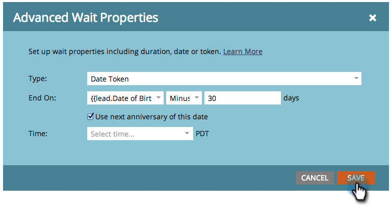

# Utiliser un jeton de date dans une étape de flux Attendre {#use-a-date-token-in-a-wait-flow-step}

Vous pouvez utiliser l’étape Flux d’attente pour suspendre le parcours d’une personne par le biais d’une campagne intelligente jusqu’à une date particulière qui utilise un jeton de date. Vous pouvez également modifier la date de fin d’un certain nombre de jours.

>[!NOTE]
>
>Cela s’applique uniquement aux campagnes Trigger. Vous ne pouvez pas utiliser cette fonctionnalité dans les campagnes par lots.

1. Dans l’onglet **[!UICONTROL Flux]** de votre campagne dynamique, faites glisser sur l’étape de flux **[!UICONTROL Attente]**.

   

1. Cliquez sur l’icône d’engrenage.

   

1. Dans la liste déroulante **[!UICONTROL Type]**, sélectionnez **[!UICONTROL Jeton de date]**.

   

1. Choisissez un [!UICONTROL jeton de date] pour spécifier le moment où l’étape d’attente doit se terminer :

   * `{{my._____}}`
   * `{{lead.______}}`
   * `{{company.______}}`
   * `{{system._______}}`

   

1. Pour attendre le prochain anniversaire de la date de l&#39;année civile en cours ou de la prochaine année civile, cochez la case.

   

   >[!TIP]
   >
   >Utilisez cette option sur les jetons de date qui font référence à des dates antérieures, telles qu’une date d’anniversaire ou de début de contrat.

1. Vous pouvez éventuellement modifier la date de fin d’un nombre de jours spécifié.

   

   >[!NOTE]
   >
   >Vous pouvez également spécifier le nombre de jours à l’aide d’un jeton `{{lead.` ou `{{company.` qui représente un champ entier ou un jeton `{{my.` de type nombre.

1. Cliquez sur **[!UICONTROL Enregistrer]**

   

   >[!MORELIKETHIS]
   >
   >* [Utiliser une durée dans une étape de flux d’attente](/help/marketo/product-docs/core-marketo-concepts/smart-campaigns/flow-actions/wait/use-a-duration-in-a-wait-flow-step.md){target="_blank"}
   >* [Utiliser une date spécifique dans une étape de flux d’attente](/help/marketo/product-docs/core-marketo-concepts/smart-campaigns/flow-actions/wait/use-a-specific-date-in-a-wait-flow-step.md){target="_blank"}
