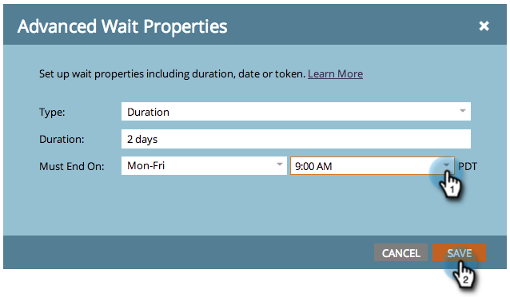

# Utilisation d’une durée dans une étape de flux d’attente {#use-a-duration-in-a-wait-flow-step}

Vous pouvez utiliser l’étape de flux d’attente pour suspendre le parcours d’une personne lors d’une campagne dynamique pendant une certaine durée. Vous pouvez également spécifier des critères pour le jour de la semaine et l’heure de fin.

1. Dans l’onglet **[!UICONTROL Flux]** de votre campagne dynamique, faites glisser le curseur sur l’étape de flux **[!UICONTROL Attente]** .

   

1. Saisissez la durée de la pause.

   

1. C&#39;est tout ! Le flux est interrompu pendant la durée que vous avez spécifiée. Pour les options avancées, cliquez sur l’icône d’engrenage à droite.

   

1. Spécifiez le jour de la semaine où l’étape d’attente doit se terminer.

   

1. Vous pouvez éventuellement spécifier l’heure. Cliquez sur **[!UICONTROL Enregistrer]**.

   

   >[!NOTE]
   >
   >**Exemple**
   >
   >Une personne déclenche une campagne dynamique le vendredi à 17 heures. L’étape d’attente est avancée : 48 heures et doit se terminer le lundi-vendredi à 9h du matin.
   >
   >Le résultat serait que la personne continuerait dans le flux le **lundi, 9h00**. Il s’agit de la première date M-F après 48 heures.

   >[!NOTE]
   >
   >La durée, les dates, les heures et les jours utilisés dépendent du fuseau horaire de votre abonnement.

   >[!MORELIKETHIS]
   >
   >* [Utiliser une date spécifique dans une étape de flux d’attente](/help/marketo/product-docs/core-marketo-concepts/smart-campaigns/flow-actions/wait/use-a-specific-date-in-a-wait-flow-step.md){target="_blank"}
   >* [Utiliser un jeton de date dans une étape de flux d’attente](/help/marketo/product-docs/core-marketo-concepts/smart-campaigns/flow-actions/wait/use-a-date-token-in-a-wait-flow-step.md){target="_blank"}
