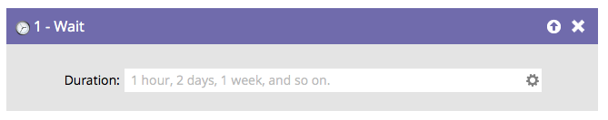

# Présentation de l’attente {#wait-overview}

Mettez une personne en pause dans un flux de campagne dynamique avec l’ **étape d’attente** pratique.

Remarquez comment vous pouvez taper en langage naturel comme &quot;4 heures&quot;. Toutefois, abréviez les mots **not** (soit 4 heures). La campagne dynamique s’exécute toujours, mais l’étape d’attente est ignorée.

>[!CAUTION]
>
>La modification de la durée d’une étape d’attente n’affecte pas les personnes qui y ont déjà participé. Par exemple : vous avez une étape d’attente de 5 jours, une personne y accède, puis vous définissez l’étape d’attente sur 7 jours ; cette personne n’attendra que les 5 jours d’origine avant de passer à l’étape de flux suivante.

>[!TIP]
>
>Si vous avez déjà un utilisateur dans une étape d’attente et que vous ne souhaitez pas qu’il avance une fois la période d’attente terminée, insérez [remove from flow](/help/marketo/product-docs/core-marketo-concepts/smart-campaigns/flow-actions/remove-from-flow.md) juste après l’étape d’attente. Indiquez qui vous souhaitez supprimer à l’aide de l’option [add choice](/help/marketo/product-docs/core-marketo-concepts/smart-campaigns/flow-actions/use-add-choice-in-a-flow-step.md) .

Il existe trois méthodes principales pour utiliser une étape de flux d’attente :

1. [Utilisation d’une durée dans une étape de flux d’attente](/help/marketo/product-docs/core-marketo-concepts/smart-campaigns/flow-actions/wait/use-a-duration-in-a-wait-flow-step.md)
1. [Utilisation d’une date spécifique dans une étape de flux d’attente](/help/marketo/product-docs/core-marketo-concepts/smart-campaigns/flow-actions/wait/use-a-specific-date-in-a-wait-flow-step.md)
1. [Utilisation d’un jeton de date dans une étape de flux d’attente](/help/marketo/product-docs/core-marketo-concepts/smart-campaigns/flow-actions/wait/use-a-date-token-in-a-wait-flow-step.md)
