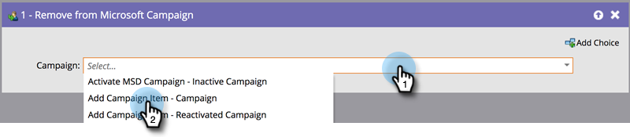

# Ajouter ou supprimer des personnes de votre campagne [!DNL Dynamics] {#add-or-remove-people-from-your-dynamics-campaign}

## Ajouter à Dynamics Campaign {#add-to-dynamics-campaign}

Cette étape de flux peut être utilisée dans les campagnes intelligentes Marketo Engage pour ajouter des personnes en tant que prospects ou contacts dans une campagne Microsoft. Si le prospect n’existe pas encore dans Dynamics, il sera automatiquement synchronisé et ajouté à la campagne.

>[!NOTE]
>
>Cette action de flux est disponible uniquement pour les campagnes de déclenchement.

Dans votre campagne intelligente, recherchez et sélectionnez la campagne Dynamics à laquelle vous souhaitez ajouter vos personnes.

>[!NOTE]
>
>Si une campagne Dynamics n’apparaît pas dans la liste des campagnes :
>
>* Vérifier que la synchronisation de la campagne est fonctionnelle
>* La campagne n’est pas active dans [!DNL Microsoft Dynamics]

Le système crée automatiquement une liste marketing statique spécifique à une campagne, pour chaque prospect et contact, à laquelle ajouter la personne. Il s’agit d’une action unique, qui n’est utilisée qu’une seule fois pour les synchronisations suivantes de la campagne. La norme de dénomination adoptée pour le nom statique de la liste marketing est `Mkto-leads-<uniqueID>` pour les prospects et `Mkto-contacts-<uniqueID>` pour les contacts.

L’association de ces listes marketing générées par Marketo à d’autres campagnes peut entraîner un comportement déroutant. Par exemple : l’ajout de à une campagne entraîne également l’ajout de à la deuxième campagne. De même, il n’est pas recommandé de dissocier la liste marketing générée par Marketo de la campagne dans [!DNL Dynamics].

## Supprimer de Dynamics Campaign {#remove-from-dynamics-campaign}

Cette étape de flux peut être utilisée dans les campagnes intelligentes Marketo pour supprimer des personnes d’une campagne Microsoft. Cette opération supprime uniquement les prospects d’une campagne qui ont été précédemment ajoutés à la campagne par le biais de l’action de flux « Ajouté à Microsoft Campaign ».

>[!NOTE]
>
>Cette action de flux est disponible uniquement pour les campagnes de déclenchement.

Dans votre campagne intelligente, recherchez et sélectionnez la campagne Dynamics dont vous souhaitez supprimer vos membres.

>[!NOTE]
>
>Si aucune campagne [!DNL Dynamics] n’apparaît dans la liste des campagnes :
>
>* Vérifier que la synchronisation de la campagne est fonctionnelle
>* La campagne n’est pas active dans [!DNL Microsoft Dynamics]
