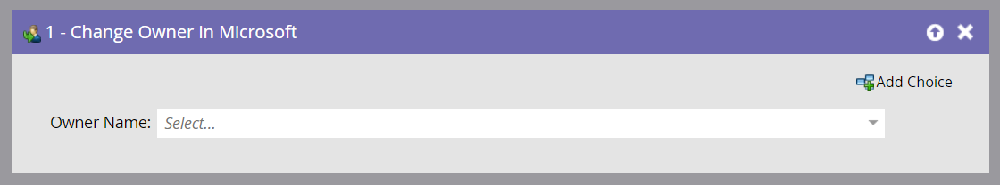

# Modifier le propriétaire dans Microsoft {#change-owner-in-microsoft}

Si des personnes existantes sont déjà affectées à un propriétaire, vous pouvez utiliser cette étape de flux pour les réaffecter à un autre propriétaire.

>[!NOTE]
>
>Cette étape de flux ne fonctionne **que lorsqu’elle est utilisée avec des déclencheurs** et non des filtres dans votre campagne dynamique.

**Utilisation**

1. Il vous suffit de choisir le propriétaire que vous voulez changer et partir !

   

   >[!NOTE]
   >
   >Si l&#39;enregistrement n&#39;existe pas encore dans votre compte Dynamics, nous allons le synchroniser, puis l&#39;affecter à l&#39;utilisateur sélectionné.

