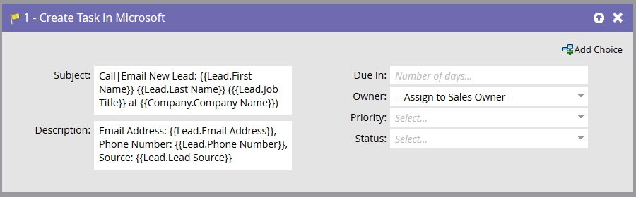

# Créer une Tâche dans Microsoft {#create-task-in-microsoft}

En tant que spécialiste du marketing, vous disposez d’informations qui peuvent aider les ventes à conclure des affaires. Vous pouvez créer des tâches pour leur indiquer ce qu’ils doivent faire et quand ils doivent le faire.

Créer une Tâche dans Microsoft crée une tâche sous Activités liées à la personne (responsable ou contact) dans Microsoft.

>[!NOTE]
>
>Cette étape de flux ne fonctionne **que lorsqu’elle est utilisée avec des déclencheurs** et non des filtres dans votre campagne dynamique.

Par défaut, l’étape de flux se présente comme suit :   

>[!NOTE]
>
>Lorsque l&#39;utilisateur de synchronisation du marketing crée des tâches, **Due In **est un champ obligatoire pour que la tâche soit créée dans Microsoft. Si aucune valeur n’est saisie, Marketo saisit cinq jours par défaut.

Personnalisez tous les champs pour créer la tâche comme vous le souhaitez.   

>[!NOTE]
>
>Le champ &quot;État&quot; spécifié pour la tâche dans l’action de flux met à jour le champ : &quot;Motif du statut&quot; dans Microsoft.

>[!TIP]
>
>Vous pouvez utiliser `{{lead.tokens}}`, `{{company.tokens}}``{{campaign.tokens}}` et `{{system.tokens}}` dans le **sujet** et la **description.** Voir [Jetons pour les étapes](http://docs.marketo.com/x/c4AR) de flux pour plus d’informations.

