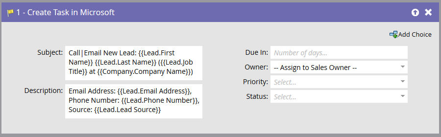

# Créer une tâche dans Microsoft {#create-task-in-microsoft}

En tant que spécialiste marketing, vous disposez d’informations qui peuvent aider les ventes à conclure des offres. Vous pouvez créer des tâches pour leur indiquer ce qu’elles doivent faire et quand elles doivent le faire.

Créer une tâche dans Microsoft crée une tâche sous Activités liées à la personne (lead ou contact) dans [!DNL Microsoft].

>[!NOTE]
>
>Cette étape de flux _ne fonctionne qu’avec des déclencheurs_ et non des filtres, dans votre campagne intelligente.

Par défaut, l’étape de flux se présente comme suit :

>[!NOTE]
>
>Lorsque l’utilisateur de la synchronisation Marketo crée des tâches, le champ **[!UICONTROL Échéance en cours]** est obligatoire pour que la tâche soit créée en [!DNL Microsoft]. Marketo saisit cinq jours par défaut si aucune valeur n’est saisie.

Personnalisez tous les champs pour créer la tâche comme vous le souhaitez.

>[!NOTE]
>
>Le champ « Statut » spécifié pour la tâche dans l’action de flux met à jour le champ « Raison du statut » dans [!DNL Microsoft].

>[!TIP]
>
>Vous pouvez utiliser `{{lead.tokens}}`, `{{company.tokens}}`, `{{campaign.tokens}}` et `{{system.tokens}}` dans les **[!UICONTROL Objet]** et **[!UICONTROL Description]**. Voir [Jetons pour les étapes de flux](/help/marketo/product-docs/core-marketo-concepts/smart-campaigns/flow-actions/use-tokens-in-flow-steps.md){target="_blank"} pour plus d’informations.
