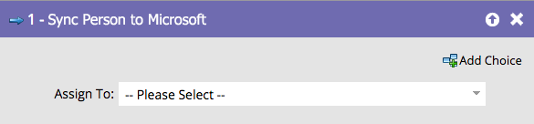

# Synchroniser individu dans Microsoft {#sync-person-to-microsoft}

Cette fonctionnalité est réservée à ceux qui intègrent Marketo Engage à [!DNL Microsoft Dynamics].

## Vue d’ensemble {#overview}

Cette étape de flux insère les personnes créées par Marketo dans votre CRM [!DNL Dynamics].

## Utilisation {#usage}

Vous pouvez définir un utilisateur [!DNL Dynamics] comme propriétaire de la personne.

>[!NOTE]
>
>Lors de l’utilisation de l’action de flux « [!UICONTROL Synchroniser la personne avec Microsoft] » (dans une campagne Trigger uniquement), le prospect/contact est créé en temps réel dans Dynamics.
