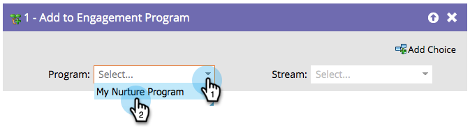

# Ajouter au programme d&#39;engagement {#add-to-engagement-program}

La campagne dynamique que vous créez à l’aide de cette étape de flux sera la passerelle de votre programme d’engagement.

1. Sélectionnez le programme d’engagement auquel vous souhaitez ajouter les personnes.

   

1. Sélectionnez le flux dans lequel vous souhaitez placer les personnes.

   

   >[!NOTE]
   >
   >Vous ne pouvez pas ajouter une personne à plusieurs diffusions dans le même programme.
