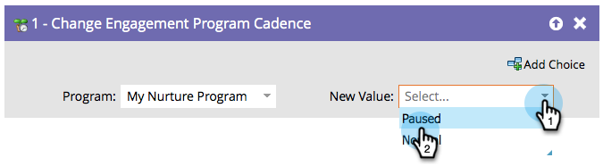

# Modifier le rythme du programme d&#39;engagement {#change-engagement-program-cadence}

Une fois qu’une personne est encouragée par un programme d’engagement, vous pouvez temporairement la suspendre en utilisant cette étape de flux.

>[!NOTE]
>
>Si une personne n’est pas membre du programme et passe par cette étape de flux, elle sera automatiquement ajoutée en tant que membre et dans votre premier flux.

1. Sélectionnez le programme d’engagement.

   

1. Sélectionnez **[!UICONTROL En pause]** comme **[!UICONTROL Nouvelle valeur]** pour empêcher la personne de recevoir du contenu.

   

Vous pouvez redéfinir la personne sur **[!UICONTROL Normal]** si vous souhaitez qu’elle recommence à recevoir du contenu.
