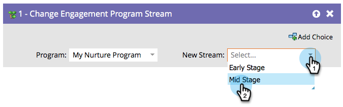

# Modifier le stream du programme d&#39;engagement {#change-engagement-program-stream}

En règle générale, vous utiliseriez [règles de transition de flux](/help/marketo/product-docs/email-marketing/drip-nurturing/engagement-program-streams/transition-people-between-engagement-streams.md) pour y parvenir. Mais si vous souhaitez déplacer manuellement des personnes d’un flux à un autre, il s’agit de l’étape de flux à utiliser.

1. Sélectionnez le programme d’engagement dans lequel vous souhaitez déplacer la personne.

   >[!NOTE]
   >
   >Si vous sélectionnez un autre programme, la personne reste dans son flux actuel et l’ajoute au nouveau.

   

1. Sélectionnez le flux auquel vous souhaitez ajouter vos personnes.

   

Et c&#39;est tout !
