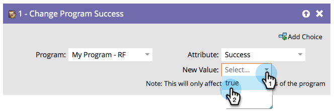

# Modifier les succès du programme {#change-program-success}

Si un groupe de personnes a été marqué avec succès du programme de manière incorrecte, vous pouvez utiliser cette étape de flux pour définir la réussite sur true ou false.

1. Lorsque vous faites glisser cette étape de flux, le programme est automatiquement défini sur le programme qui contient la campagne dynamique que vous modifiez.

   >[!NOTE]
   >
   >Seuls les membres du programme seront affectés.

   

1. Sélectionnez **[!UICONTROL Succès]** ou **[!UICONTROL Date de succès]** comme attribut.

   

   >[!NOTE]
   >
   >La définition de la date de succès sur un élément définit automatiquement la réussite sur true. La définition de la variable Succès sur true définit automatiquement la Date de succès sur la date actuelle.

1. Définissez la **[!UICONTROL Nouvelle valeur]** sur **[!UICONTROL True]** ou **[!UICONTROL False]**.

   

   >[!TIP]
   >
   >Vous pouvez utiliser l’étape de flux deux fois pour définir à la fois l’indicateur de succès et la date.

Fantastique ! Maintenant, vous savez comment annuler et forcer le succès.
