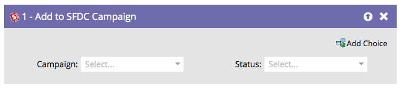
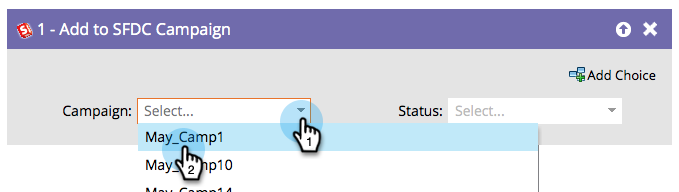

# Ajouter à la campagne SFDC {#add-to-sfdc-campaign}

Cette étape de flux peut être utilisée dans les campagnes Marketo Engage ou comme étape de flux unique pour ajouter des personnes en tant que prospects dans une campagne Salesforce. Si le prospect n’existe pas encore dans Salesforce, il est automatiquement synchronisé et ajouté à la campagne avec le statut spécifié.

>[!NOTE]
>
>Disponible uniquement lorsqu’il est intégré à [!DNL Salesforce].

## Utilisation {#usage}

1. Recherchez et sélectionnez la campagne [!DNL Salesforce] à laquelle vous souhaitez ajouter vos prospects.

   

   >[!TIP]
   >
   >Si vous ne pouvez pas voir de campagne Salesforce dans la liste des campagnes :
   >
   > 1. Assurez-vous que la [synchronisation de la campagne est activée](/help/marketo/product-docs/crm-sync/salesforce-sync/setup/optional-steps/enable-disable-campaign-sync.md){target="_blank"}.
   > 1. Vérifiez que votre [utilisateur de synchronisation Marketo](/help/marketo/product-docs/crm-sync/salesforce-sync/setup/enterprise-unlimited-edition/step-2-of-3-create-a-salesforce-user-for-marketo-enterprise-unlimited.md){target="_blank"} est un [utilisateur marketing](/help/marketo/product-docs/crm-sync/salesforce-sync/setup/optional-steps/enable-disable-campaign-sync/make-marketo-sync-user-a-marketing-user.md){target="_blank"} dans Salesforce.

   >[!TIP]
   >
   >Vous pouvez utiliser la campagne Salesforce [Mes jetons](/help/marketo/product-docs/core-marketo-concepts/programs/tokens/managing-my-tokens.md){target="_blank"} pour faciliter le clonage de programmes.

1. Sélectionnez le statut de membre de la campagne [!DNL Salesforce] que vous souhaitez affecter aux prospects une fois qu’ils ont été ajoutés.

   

   >[!CAUTION]
   >
   >Si une personne est déjà membre principal de la campagne Salesforce, elle sera ignorée et son statut ne sera PAS mis à jour. Vous pouvez utiliser [modifier leur statut dans une campagne SFDC](/help/marketo/product-docs/core-marketo-concepts/smart-campaigns/salesforce-flow-actions/change-status-in-sfdc-campaign.md){target="_blank"} à la place.
