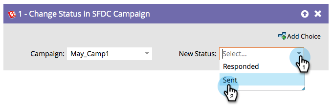

# Modifier le statut dans SFDC Campaign {#change-status-in-sfdc-campaign}

>[!NOTE]
>
>Disponible uniquement lorsqu&#39;il est intégré à Salesforce.

## Aperçu {#overview}

Cette étape de flux vous permet de modifier l&#39;état des membres de campagne Salesforce des pistes.

Si une piste n&#39;existe pas dans Salesforce ou n&#39;est pas encore membre de la campagne, elle est automatiquement synchronisée et ajoutée à la campagne Salesforce avec le statut approprié.

## Utilisation {#usage}

1. Recherchez et sélectionnez d&#39;abord le Salesforce **Campaign** dans lequel se trouve l&#39;enregistrement.

   

1. Sélectionnez ensuite le **nouvel état** que vous souhaitez définir et vous avez terminé !

   
