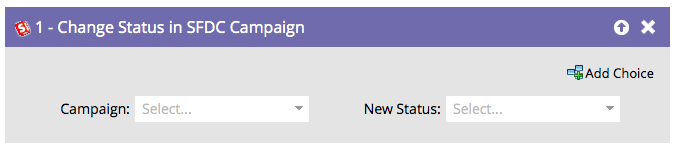

# Modifier le statut dans une campagne SFDC {#change-status-in-sfdc-campaign}

Cette étape de flux vous permet de modifier le statut de membre de campagne Salesforce des prospects.

>[!NOTE]
>
>Disponible uniquement lorsqu’il est intégré à [!DNL Salesforce].

Si un prospect n’existe pas dans Salesforce ou n’est pas encore membre de la campagne, il est automatiquement synchronisé et ajouté à la campagne Salesforce avec le statut approprié.

1. Recherchez et sélectionnez d’abord le Salesforce **[!UICONTROL Campaign]** dans lequel se trouve l’enregistrement.

   

1. Sélectionnez ensuite le **[!UICONTROL Nouveau statut]** à définir, et c’est terminé !

   
