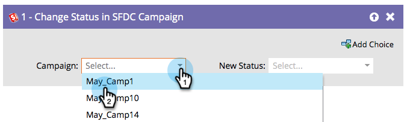

# Modifier le statut dans une campagne SFDC {#change-status-in-sfdc-campaign}

Cette étape de flux vous permet de modifier l’état des membres de campagne Salesforce des pistes.

>[!NOTE]
>
>Disponible uniquement lorsqu’il est intégré à Salesforce.

Si une piste n’existe pas dans Salesforce ou n’est pas encore membre de la campagne, elle est automatiquement synchronisée et ajoutée à la campagne Salesforce avec le statut approprié.

1. Recherchez et sélectionnez tout d’abord le Salesforce **[!UICONTROL Campaign]** dans lequel se trouve l’enregistrement.

   

1. Sélectionnez ensuite le **[!UICONTROL nouvel état]** que vous souhaitez définir, et vous avez terminé !

   
