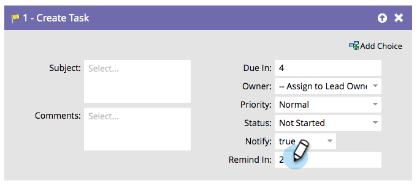

# Créer une tâche {#create-task}

En tant que spécialiste marketing, vous disposez d’informations qui peuvent aider les ventes à conclure des offres. Vous pouvez créer des tâches pour leur indiquer ce qu’elles doivent faire et quand elles doivent le faire.

>[!NOTE]
>
>Lorsque l’utilisateur de la synchronisation Marketo crée des tâches, le champ **[!UICONTROL Échéance en cours]** est obligatoire pour que la tâche soit créée dans Salesforce. Marketo saisit cinq jours par défaut s’il n’existe aucune valeur.

Par défaut, l’étape de flux se présente comme suit :

Personnalisez tous les champs pour créer la tâche comme vous le souhaitez.

>[!TIP]
>
>Vous pouvez utiliser `{{lead.tokens}}`, `{{company.tokens}}`, `{{campaign.tokens}}` et `{{system.tokens}}` dans les **[!UICONTROL Objet]** et **[!UICONTROL Description]**. Voir [Jetons pour les étapes de flux](/help/marketo/product-docs/core-marketo-concepts/smart-campaigns/flow-actions/use-tokens-in-flow-steps.md){target="_blank"} pour plus d’informations.
