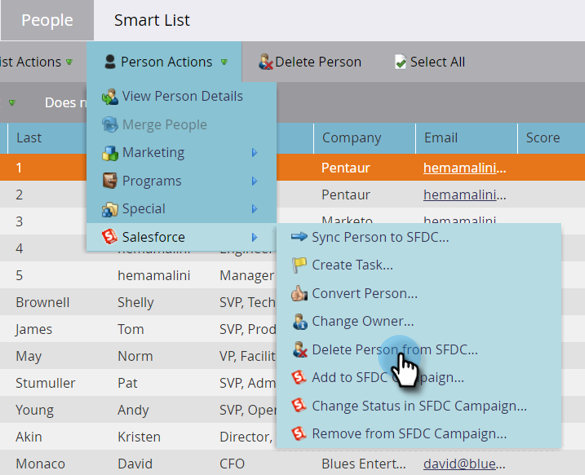

# Supprimer une personne de SFDC {#delete-person-from-sfdc}

Si vous devez supprimer un ensemble spécifique de prospects de Salesforce, mais les laisser en tant que personnes dans Marketo Engage, vous pouvez utiliser l’action de flux Supprimer une personne de SFDC .

>[!NOTE]
>
>Disponible uniquement lorsqu’il est intégré à [!DNL Salesforce].

1. Dans la base de données, cliquez sur la personne à supprimer de Salesforce. Cliquez ensuite sur **[!UICONTROL Actions de la personne]** et sélectionnez **[!DNL Salesforce]**.

   

1. Sélectionnez **[!UICONTROL Supprimer une personne de SFDC]**.

   

1. Assurez-vous que le paramètre **[!UICONTROL Supprimer dans Marketo]** est défini sur **[!UICONTROL false]**, puis cliquez sur **[!UICONTROL Exécuter maintenant]**.

   

   Une fois l’étape de flux exécutée, votre personne ne sera plus un prospect dans [!DNL Salesforce], mais restera dans Marketo.

   >[!CAUTION]
   >
   >Si vous définissez **[!UICONTROL Supprimer dans Marketo]** sur **[!UICONTROL true]** et supprimez les personnes de Marketo et les prospects de Salesforce, leur annulation est définitive. Cette opération est irréversible.
