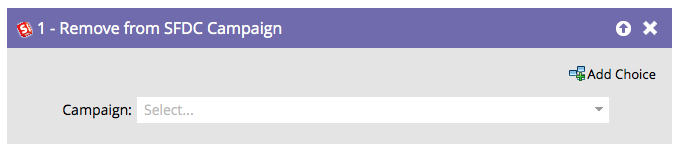

# Supprimer de la campagne SFDC {#remove-from-sfdc-campaign}

Tout comme vous pouvez [Ajouter à la campagne SFDC](/help/marketo/product-docs/core-marketo-concepts/smart-campaigns/salesforce-flow-actions/add-to-sfdc-campaign.md){target="_blank"} et [Modifier l’état dans la campagne SFDC](/help/marketo/product-docs/core-marketo-concepts/smart-campaigns/salesforce-flow-actions/change-status-in-sfdc-campaign.md){target="_blank"}, vous pouvez également supprimer des personnes ou des pistes d’une campagne Salesforce.

>[!NOTE]
>
>Disponible uniquement lorsqu’il est intégré à Salesforce.

1. Une fois que vous avez fait glisser l’étape de flux, recherchez et sélectionnez la campagne Salesforce à partir de laquelle vous souhaitez supprimer la personne ou le prospect.

   

   >[!TIP]
   >
   >Si la personne ou le prospect n’est pas un membre de la campagne que vous avez sélectionnée, il sera ignoré.

C&#39;est tout ! Lorsque des personnes ou des pistes sont acheminées, elles sont supprimées de la campagne Salesforce que vous avez choisie.
