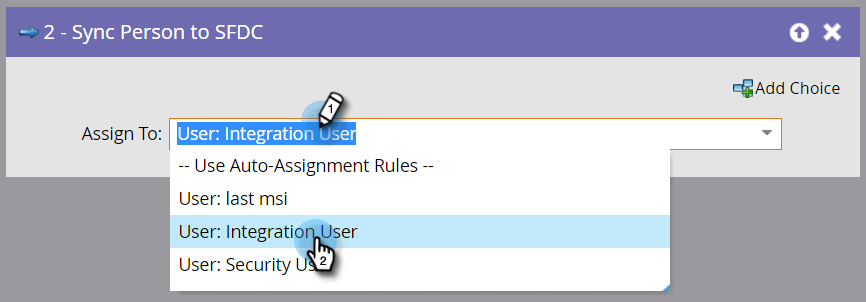

# Synchroniser une personne dans SFDC {#sync-person-to-sfdc}

Cette étape de flux insérera des personnes créées par Marketo en tant que prospects dans votre CRM Salesforce.

>[!NOTE]
>
>Disponible uniquement lorsqu’il est intégré à [!DNL Salesforce].

1. Par défaut, cette étape de flux est affectée aux propriétaires de prospect en fonction des règles d’affectation automatique de Salesforce.

   

   >[!TIP]
   >
   >[!DNL Salesforce] nécessite que la personne ait renseigné les champs Société et Nom . Dans le cas contraire, l’enregistrement du prospect sera rejeté.

1. Vous pouvez définir un utilisateur [!DNL Salesforce] ou une file d’attente de prospects spécifique en tant que propriétaire de prospects.

   

   Lors de l’utilisation de cette étape de flux, la personne est synchronisée immédiatement en tant que prospect [!DNL Salesforce] et n’a pas besoin d’attendre la synchronisation normale.

   >[!CAUTION]
   >
   >[!DNL Salesforce] n’autorise pas l’affectation de « contacts » aux files d’attente de prospects. Dans ce cas, Marketo crée un « Lead » en double dans [!DNL Salesforce].
