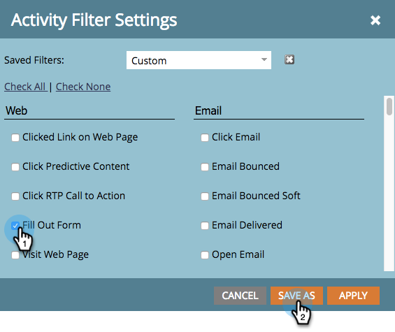

# Filtrer les résultats d’une campagne intelligente {#filter-smart-campaign-results}

>[!PREREQUISITES]
>
>[Afficher les résultats de la campagne intelligente](/help/marketo/product-docs/core-marketo-concepts/smart-campaigns/smart-campaign-data/view-smart-campaign-results.md)

Filtrez les résultats des campagnes intelligentes pour afficher les activités spécifiques qui vous intéressent.

## Filtrer par filtres enregistrés {#filter-by-saved-filters}

1. Dans l’onglet **[!UICONTROL Résultats]** de votre campagne dynamique, cliquez sur **[!UICONTROL Filtrer]** et sélectionnez un filtre enregistré.

   

   >[!NOTE]
   >
   >Par défaut, aucun filtre n’est appliqué et les résultats affichent toutes les activités.

## Créer un filtre personnalisé {#create-a-custom-filter}

1. Cliquez sur **[!UICONTROL Filtrer]**, puis **[!UICONTROL Personnaliser]**.

   

1. Sélectionnez les types d’activité à afficher, puis cliquez sur **[!UICONTROL Enregistrer sous]**.

   

   >[!TIP]
   >
   >Cliquez sur **[!UICONTROL Appliquer]** pour appliquer directement un filtre personnalisé à vos résultats sans l’enregistrer.

1. Saisissez un nom de filtre et cliquez sur **[!UICONTROL Enregistrer]**.

   

1. Le filtre personnalisé sera appliqué à vos résultats et est désormais disponible dans la liste déroulante (vous devrez peut-être actualiser la page pour l’afficher dans la liste déroulante).

   
