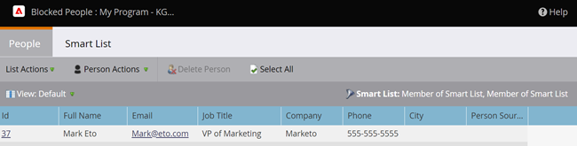

# Affichage des personnes bloquées dans une campagne dynamique {#view-blocked-people-in-a-smart-campaign}

Les personnes bloquées dans la base de données Marketo Engage placer sur la liste bloquée sont marquées comme étant bloquées, désabonnées, dont le marketing est suspendu et/ou ont un e-mail non valide ou vide.

1. Dans votre campagne dynamique, cliquez sur **[!UICONTROL Planifier]**. Sous **[!UICONTROL Statut de la liste dynamique]**, cliquez sur le deuxième lien.

   

   >[!NOTE]
   >
   >Les personnes qui ont atteint leurs limites de communication peuvent également être bloquées pour recevoir des e-mails. Découvrez comment [modifier les limites de communication](/help/marketo/product-docs/administration/email-setup/enable-communication-limits.md){target="_blank"} dans la section Admin.

   L’onglet **[!UICONTROL Leads bloqués]** affiche les personnes qui ne reçoivent pas de publipostage.

   

   >[!NOTE]
   >
   >Les e-mails opérationnels seront envoyés aux personnes marquées comme désabonnées et dont le marketing est suspendu.

   >[!MORELIKETHIS]
   >
   >* [Modifier les règles de qualification](/help/marketo/product-docs/core-marketo-concepts/smart-campaigns/using-smart-campaigns/edit-qualification-rules-in-a-smart-campaign.md){target="_blank"}
   >* [Activer les limites de communication](/help/marketo/product-docs/administration/email-setup/enable-communication-limits.md){target="_blank"}
   >* [Afficher les membres de la campagne intelligente](/help/marketo/product-docs/core-marketo-concepts/smart-campaigns/smart-campaign-data/view-smart-campaign-members.md){target="_blank"}
   >* [Afficher les personnes qualifiées dans une campagne dynamique](/help/marketo/product-docs/core-marketo-concepts/smart-campaigns/smart-campaign-data/view-qualified-people-in-a-smart-campaign.md){target="_blank"}
