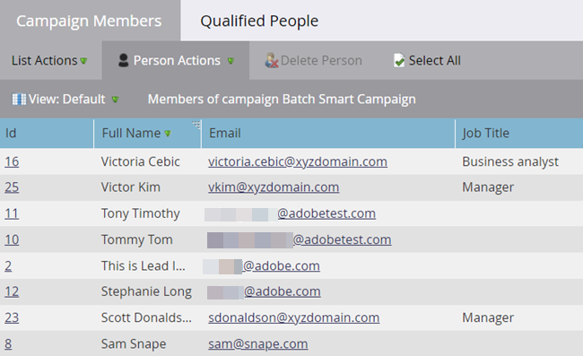

# Affichage des membres de campagne dynamique {#view-smart-campaign-members}

Affichez les personnes qui ont déjà parcouru le flux de campagne dynamique.

1. Accédez à **[!UICONTROL Activités marketing]**.

   

1. Dans votre campagne dynamique, cliquez sur **[!UICONTROL Afficher les membres de campagne]**.

   

   >[!TIP]
   >
   >Vous pouvez afficher les membres de la campagne n’importe où dans une campagne dynamique.

1. L’onglet **[!UICONTROL Membres de la campagne]** affiche les personnes qui ont déjà parcouru le flux de la campagne dynamique.

   

   >[!NOTE]
   >
   >La liste des membres de campagne sera initialement vide lorsque la campagne dynamique ne s’est exécutée sur aucune personne.

   >[!MORELIKETHIS]
   >
   >[Afficher les personnes bloquées dans une campagne dynamique](/help/marketo/product-docs/core-marketo-concepts/smart-campaigns/smart-campaign-data/view-blocked-people-in-a-smart-campaign.md){target="_blank"}
