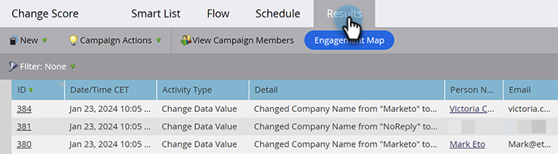
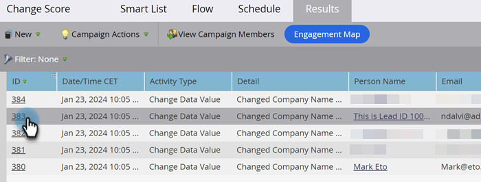

# Afficher les résultats d’une campagne intelligente {#view-smart-campaign-results}

Vous souhaitez voir une répartition de tout ce qui s’est passé dans une campagne intelligente ? Voici comment faire.

>[!TIP]
>
>Pour afficher la liste des personnes qui ont été traitées par la campagne intelligente, cliquez sur [Afficher les membres de la campagne](/help/marketo/product-docs/core-marketo-concepts/smart-campaigns/smart-campaign-data/view-smart-campaign-members.md){target="_blank"}.

1. Dans votre campagne dynamique, cliquez sur **[!UICONTROL Résultats]**.

   

   >[!TIP]
   >
   >Vous pouvez également filtrer les résultats en fonction du type d’activité. Découvrez comment [filtrer les résultats des campagnes intelligentes](/help/marketo/product-docs/core-marketo-concepts/smart-campaigns/smart-campaign-data/filter-smart-campaign-results.md){target="_blank"}.

1. Cliquez sur un **[!UICONTROL ID]** pour afficher plus de détails sur cette activité spécifique.

   

   >[!TIP]
   >
   >Affichez les détails de la personne en cliquant sur son nom.

   Explorez les résultats pour voir ce qu’a réellement fait votre campagne ou [exportez simplement les résultats de campagne intelligente vers Excel](/help/marketo/product-docs/core-marketo-concepts/smart-campaigns/smart-campaign-data/export-smart-campaign-results-to-excel.md){target="_blank"}.

   >[!MORELIKETHIS]
   >
   >[Filtrer les résultats de la campagne intelligente](/help/marketo/product-docs/core-marketo-concepts/smart-campaigns/smart-campaign-data/filter-smart-campaign-results.md){target="_blank"}
