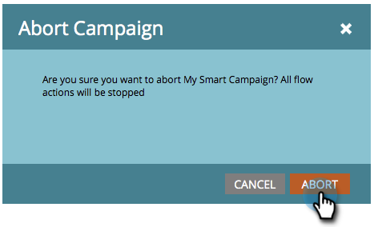

# Arrêter une campagne intelligente {#abort-a-smart-campaign}

>[!CAUTION]
>
>Réservé À Un Usage D’Urgence

Parfois, vous lancez une campagne intelligente et réalisez immédiatement que c’était une erreur. Voici comment tirer le frein d&#39;urgence et arrêter la campagne intelligente à mi-parcours.

1. Sélectionnez la campagne intelligente souhaitée et cliquez sur l’onglet **[!UICONTROL Planifier]**.

   

1. Cliquez sur la liste déroulante **[!UICONTROL Actions de campagne]**. Sélectionnez **[!UICONTROL Abandonner la campagne]**.

   

1. Cliquez sur **[!UICONTROL Abandonner]** pour confirmer.

   

   >[!NOTE]
   >
   >L’abandon n’annule pas les étapes déjà terminées, mais simplement une autre étape qui ne se produit pas (exemple : les e-mails ne peuvent pas être remis).

   

   >[!NOTE]
   >
   >Jetez un coup d’œil à l’onglet **[!UICONTROL Résultats]** de la campagne intelligente pour voir quelles actions ont eu lieu avant l’abandon. Vous trouverez également une [notification](/help/marketo/product-docs/core-marketo-concepts/miscellaneous/understanding-notifications.md){target="_blank"} avec des détails supplémentaires.

   >[!TIP]
   >
   >Vous souhaitez supprimer une personne du flux dans une campagne de déclenchement ? Extrayez [Supprimer du flux](/help/marketo/product-docs/core-marketo-concepts/smart-campaigns/flow-actions/remove-from-flow.md){target="_blank"}.

Vérifiez toujours votre travail, mais ce frein d&#39;urgence peut être utile.
