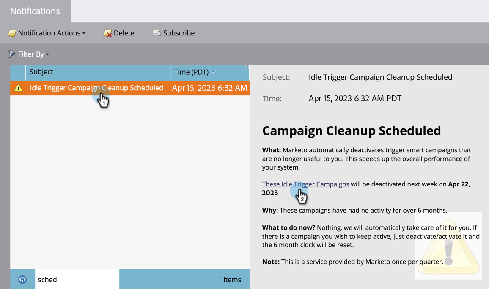

# Nettoyage des campagnes à déclencheurs automatique {#automatic-trigger-campaign-cleanup}

Marketo dispose d’un service sympa/gratuit pour désactiver les campagnes intelligentes déclenchées qui ne reçoivent plus d’activité. Cela accélère les performances globales du système et vous permet de gagner du temps.

## Que se passe-t-il ? {#what-happens}

Une fois par trimestre, Marketo trouvera les campagnes intelligentes qui sont restées en sommeil (personne) pendant 6 mois ou plus et les désactivera.

## Me préviendras-tu d&#39;abord ? {#will-you-notify-me-first}

Bien sûr ! Une fois par trimestre, vous recevrez une notification une semaine à l’avance indiquant chaque campagne que nous prévoyons de désactiver.

1. Cliquez sur le bouton **[!UICONTROL Notifications]** Icône

   

1. Cliquez sur **[!UICONTROL Nettoyage inactif des campagnes de déclenchement planifié]**. Cliquez ensuite sur le bouton **[!UICONTROL Ces campagnes de déclenchement inactives seront désactivées.]** lien.

   

   Une liste des campagnes intelligentes est alors affichée.

   

## Quelles campagnes seront désactivées ? {#which-campaigns-will-be-deactivated}

Nous ne désactiverons que les campagnes de déclenchement qui ont été actives pendant plus de 6 mois, mais qui n’ont reçu aucune qualification pendant cette période.

## Attendez ! Pas cette campagne ! {#wait-not-this-campaign}

Ne vous inquiétez pas : l’horloge d’une campagne dynamique peut être réinitialisée en procédant comme suit :

* Personne admissible pour la campagne.
* Désactivation et réactivation manuels de la campagne.

Réinitialise le compteur de 6 mois.

## Me direz-vous quelles campagnes ont été désactivées ? {#will-you-let-me-know-which-campaigns-were-deactivated}

Absolument : une semaine après la notification d’origine, nous désactiverons les campagnes répertoriées (moins celles qui ont qualifié au moins une personne ou qui ont été désactivées/réactivées) et publierons une notification de confirmation.

1. Sélectionnez la variable **[!UICONTROL Nettoyage inactif des campagnes de déclenchement planifié]** notification. Cliquez sur le bouton **[!UICONTROL Ces campagnes de déclenchement inactives]** lien.

   

1. Une liste des campagnes désactivées s’affiche.

   
