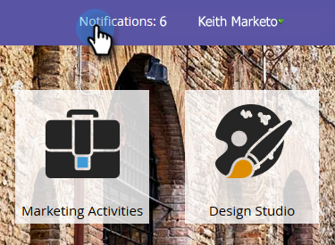

# Nettoyage Campaign de déclencheur automatique {#automatic-trigger-campaign-cleanup}

Marketo dispose d’un service agréable/gratuit pour désactiver les campagnes dynamiques déclenchées qui ne reçoivent plus d’activité. Cela accélère les performances globales du système et vous fait gagner du temps.

>[!NOTE]
>
>**FYI**
>
>Marketo est maintenant en train de normaliser la langue dans tous les abonnements. Vous pouvez donc voir des pistes dans votre abonnement et des personnes/personnes dans docs.marketo.com. Ces termes signifient la même chose ; cela n&#39;a aucune incidence sur les instructions relatives aux articles. Il y a aussi d&#39;autres changements. [En savoir plus](http://docs.marketo.com/display/DOCS/Updates+to+Marketo+Terminology).

## Que se passe-t-il ? {#what-happens}

Une fois par trimestre, Marketo trouvera des campagnes intelligentes qui sont restées en sommeil (personne) pendant 6 mois ou plus et les désactivera.

## Me préviendras-tu en premier ? {#will-you-notify-me-first}

Bien sûr ! Une fois par trimestre, vous recevrez une notification une semaine à l’avance, indiquant chaque campagne que nous prévoyons de désactiver.

1. Accédez à l’onglet **Notifications** .

   

1. Cliquez sur **Idle Trigger Campaign Cleanup Scheduled**. Cliquez ensuite sur le **lien **Ces campagnes de déclenchement inactives seront désactivées.** **

   

   Une liste de campagnes actives est prévue pour être désactivée.

   

## Quelles campagnes seront désactivées ? {#which-campaigns-will-be-deactivated}

Nous ne désactiverons que les campagnes déclencheurs qui ont été principales depuis plus de 6 mois mais qui n&#39;ont pas eu de critères pour 0 personne au cours de cette période.

## Attends ! Pas cette campagne ! {#wait-not-this-campaign}

Ne vous inquiétez pas : l&#39;horloge d&#39;une campagne intelligente peut être réinitialisée par :

* Personne remplissant les conditions requises pour la campagne.
* Désactivation et réactivation manuelles de la campagne.

Le compteur de 6 mois est réinitialisé.

## Me direz-vous quelles campagnes ont été désactivées ? {#will-you-let-me-know-which-campaigns-were-deactivated}

Absolument : une semaine après la notification initiale, nous désactiverons les campagnes répertoriées (moins celles qui ont qualifié au moins une personne ou ont été désactivées/réactivées) et publierons une notification de confirmation.

1. Sélectionnez la **notification **Idle Trigger Campaign Cleanup Scheduled **notification. Cliquez sur le lien **Ces campagnes** de déclenchement inactif.

   

1. Une liste de campagnes désactivées s’affiche.

   

