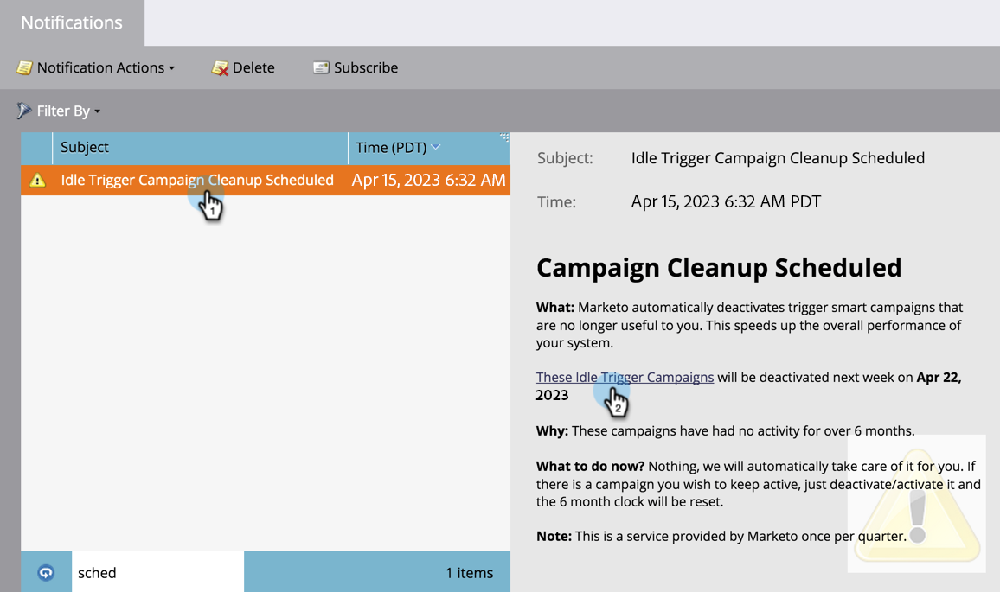
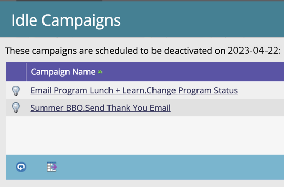

# Nettoyage automatique des campagnes à déclencheur {#automatic-trigger-campaign-cleanup}

Marketo propose un service gratuit permettant de désactiver les campagnes intelligentes déclenchées qui n’obtiennent plus d’activité. Cela permet d’accélérer les performances globales du système et de gagner du temps.

## Que se passe-t-il ? {#what-happens}

Une fois par trimestre, Marketo trouve les campagnes intelligentes qui sont restées inactives (aucune personne) pendant 6 mois ou plus et les désactive.

## Me préviendrez-vous d&#39;abord ? {#will-you-notify-me-first}

Bien sûr ! Une fois par trimestre, vous recevrez une notification une semaine à l’avance indiquant chaque campagne que nous prévoyons de désactiver.

1. Cliquez sur l’icône **[!UICONTROL Notifications]**.

   

1. Cliquez sur **[!UICONTROL Nettoyage de la campagne du déclencheur inactif planifié]**. Cliquez ensuite sur le lien **[!UICONTROL Ces campagnes de déclenchement inactives seront désactivées]**.

   

   Une liste des campagnes intelligentes planifiées pour être désactivées s’affiche.

   

## Quelles campagnes seront désactivées ? {#which-campaigns-will-be-deactivated}

Nous désactiverons uniquement les campagnes de déclenchement qui sont actives depuis plus de 6 mois, mais pour lesquelles 0 personne est éligible au cours de cette période.

## Attendez ! Pas cette campagne ! {#wait-not-this-campaign}

Ne vous inquiétez pas : l’horloge d’une campagne intelligente peut être réinitialisée en procédant comme suit :

* Personne éligible à la campagne.
* Désactivation et réactivation manuelle de la campagne.

Les deux réinitialiseront le compteur de 6 mois.

## Me ferez-vous savoir quelles campagnes ont été désactivées ? {#will-you-let-me-know-which-campaigns-were-deactivated}

Absolument : une semaine après la notification d’origine, nous désactiverons les campagnes répertoriées (moins celles qui remplissent les critères d’au moins une personne ou qui ont été désactivées/réactivées) et publierons une notification de confirmation.

1. Sélectionnez la notification **[!UICONTROL Nettoyage de la campagne du déclencheur inactif planifié]** . Cliquez sur le lien **[!UICONTROL Ces campagnes de déclenchement inactives]**.

   

1. Une liste des campagnes désactivées s’affiche.

   
