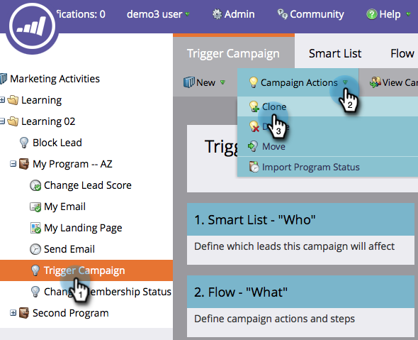

# Actions Campaign : Cloner une Campaign intelligente {#campaign-actions-clone-a-smart-campaign}

Le clonage des campagnes peut vous faire gagner du temps. Il n’est pas nécessaire de tout créer à partir de zéro : le clonage crée une campagne identique avec les mêmes filtres de liste intelligents et les mêmes étapes de flux.

1. Recherchez la campagne à cloner, sélectionnez-la, puis sous **Actions Campaign** cliquez sur **Cloner**.

   

1. Sélectionnez l’option **Cloner vers** appropriée. Dans cet exemple, choisissez **Programmes**.

   

1. Choisissez un **Programme**. Saisissez un **nom du Campaign** et cliquez sur **Clone**.

   

Et c&#39;est fait !
