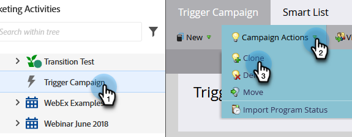

# Actions de campagne : clonage d’une campagne dynamique {#campaign-actions-clone-a-smart-campaign}

Le clonage des campagnes peut vous faire gagner du temps. Il n’est pas nécessaire de tout créer à partir de zéro : le clonage crée une campagne identique avec les mêmes filtres de liste intelligente et les mêmes étapes de flux.

1. Sélectionnez la campagne à cloner. Dans le **[!UICONTROL Actions de campagne]** , sélectionnez **[!UICONTROL Cloner]**.

   

1. Choisissez la **[!UICONTROL Cloner vers]** . Dans cet exemple, nous allons choisir **[!UICONTROL Programmes]**.

   

1. Choisissez une **[!UICONTROL Programme]**. Saisissez un **[!UICONTROL Nom de la campagne]** et cliquez sur **[!UICONTROL Cloner]**.

   

Et c&#39;est fini !
