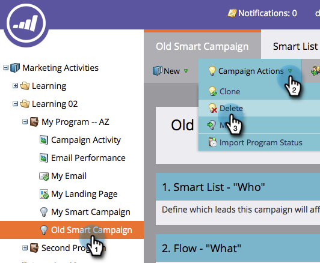

# Actions Campaign : Suppression d’une Campaign intelligente {#campaign-actions-delete-a-smart-campaign}

Si vous avez une ancienne campagne intelligente dont vous n’avez plus besoin, vous pouvez la supprimer. Voici comment.

>[!CAUTION]
>
>Assurez-vous avant de supprimer. Une fois que vous supprimez une campagne dynamique, elle ne peut plus être restaurée.

1. Accédez à la zone Activités **** marketing.

   

1. Accédez à votre campagne dynamique inactive. Sous **Campaign** **Actions**, cliquez sur **Supprimer**.

   >[!TIP]
   >
   >Pour annuler le traitement d’une principale campagne intelligente sans la supprimer complètement, apprenez à [abandonner une campagne](abort-a-smart-campaign.md)intelligente.

   

1. Cliquez sur **Supprimer** pour confirmer.

   

   >[!CAUTION]
   >
   >Ne supprimez **PAS** une principale campagne intelligente avec des personnes dans les étapes de flux. Il est probable que la campagne s’exécute toujours.

Sympa !