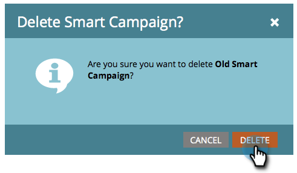

# Actions de campagne : Suppression d’une campagne dynamique {#campaign-actions-delete-a-smart-campaign}

Si vous avez une ancienne campagne dynamique dont vous n’avez plus besoin, vous pouvez la supprimer. Voici comment.

>[!CAUTION]
>
>Assurez-vous avant de supprimer. Une fois que vous avez supprimé une campagne dynamique, elle ne peut plus être restaurée.

1. Accédez au **Activités marketing** zone.

   

1. Accédez à votre campagne dynamique inactive. Dans le **Campagne** **Actions** menu déroulant, sélectionnez **Supprimer**.

   

   >[!TIP]
   >
   >Pour annuler le traitement d’une principale campagne dynamique sans la supprimer complètement, apprenez à [abandon d’une campagne dynamique](/help/marketo/product-docs/core-marketo-concepts/smart-campaigns/using-smart-campaigns/abort-a-smart-campaign.md).

1. Cliquez sur **Supprimer** pour confirmer.

   

   >[!CAUTION]
   >
   >Do **NOT** supprimer une principale campagne dynamique avec des personnes dans les étapes de flux. La campagne s’exécutera probablement toujours.
