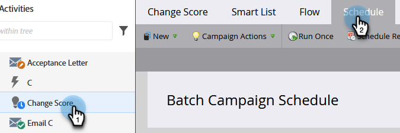

# Ignorer les restrictions de personnes dans une campagne intelligente {#override-person-restrictions-in-a-smart-campaign}

Marketo Engage vous permet de définir le nombre maximal de personnes pouvant se qualifier pour une campagne dynamique. Vous pouvez ainsi éviter d’envoyer accidentellement par e-mail l’ensemble de votre base de données. Si vous souhaitez _contourner_ cette limite, procédez comme suit.

>[!PREREQUISITES]
>
>Veillez à [activer les restrictions de personne pour les campagnes intelligentes](/help/marketo/product-docs/administration/email-setup/enable-person-restrictions-for-smart-campaigns.md){target="_blank"} dans Marketo Admin.

1. Dans **[!UICONTROL Activités marketing]**, accédez à votre campagne intelligente et cliquez sur **[!UICONTROL Planifier]**.

   

1. Dans les paramètres de campagne intelligente, cliquez sur **[!UICONTROL Modifier]**.

   

   >[!NOTE]
   >
   >La limite par défaut est celle définie dans Admin.

1. Saisissez une nouvelle limite et cliquez sur **[!UICONTROL Enregistrer]**.

   

   La campagne intelligente ne s’exécute pas si le nombre de personnes remplissant les conditions requises dépasse la limite définie.

   >[!CAUTION]
   >
   >Faites attention avec cette fonctionnalité afin de ne pas inclure accidentellement trop de personnes.
