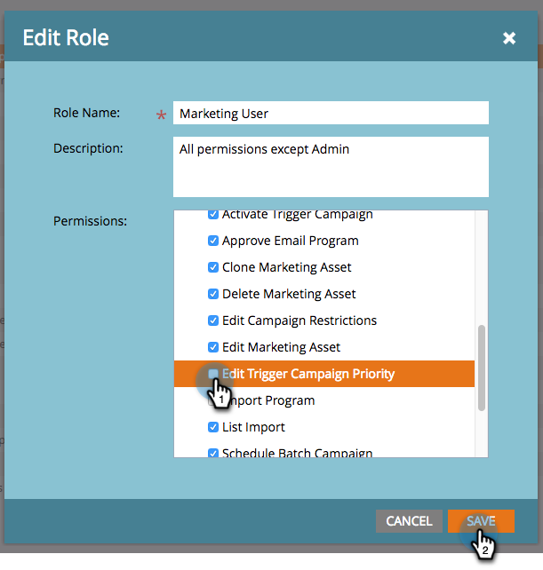

# Remplacement de priorité pour les campagnes à déclencheur {#priority-override-for-trigger-campaigns}

Les administrateurs peuvent remplacer la priorité déterminée par Marketo Engage pour les campagnes de déclenchement afin de définir des priorités qui correspondent mieux aux objectifs commerciaux.

>[!NOTE]
>
>Cette fonctionnalité n’est disponible que pour les campagnes de déclenchement et pour les utilisateurs et utilisatrices qui disposent de l’autorisation [ « Modifier la priorité des campagnes de déclenchement »](#grant-priority-override-access).

>[!CAUTION]
>
>Il est vivement conseillé d’utiliser cette fonctionnalité sur un ensemble limité de campagnes critiques pour l’entreprise (25 est le nombre maximal recommandé). L’utilisation lâche de la fonctionnalité sur un jeu volumineux peut avoir une incidence négative sur l’exécution globale de la campagne.

## Accorder un accès prioritaire de remplacement {#grant-priority-override-access}

>[!NOTE]
>
>Seuls les administrateurs ou les utilisateurs avec des responsabilités d’administrateur doivent avoir un accès de remplacement de priorité de campagne.

1. Dans la zone **[!UICONTROL Admin]**, cliquez sur **[!UICONTROL Utilisateurs et rôles]**.

   

1. Cliquez sur l’onglet **[!UICONTROL Rôles]**, sélectionnez l’utilisateur auquel vous souhaitez accorder l’accès, puis cliquez sur **[!UICONTROL Modifier le rôle]**.

   

1. Sous **[!UICONTROL Accéder aux activités marketing]**, sélectionnez **[!UICONTROL Modifier la priorité des campagnes de déclenchement]**. Cliquez sur **[!UICONTROL Enregistrer]**

   

## Annuler la priorité {#override-priority}

1. Recherchez votre campagne Trigger. Cliquez dessus avec le bouton droit et sélectionnez **[!UICONTROL Remplacer la priorité de campagne]**.

   

1. Cliquez sur le curseur **[!UICONTROL Remplacer la priorité de campagne]** pour l’activer. Choisissez un nouveau niveau de priorité et cliquez sur **[!UICONTROL Confirmer]**.

   

   Le nouveau niveau de priorité s’affiche dans l’onglet **[!UICONTROL Planifier]**.

   

>[!NOTE]
>
>* Vous pouvez afficher la priorité par défaut de votre campagne dans la [!UICONTROL File d’attente de la campagne] sous [!UICONTROL Activités marketing]. Pour augmenter le taux d’exécution, nous vous recommandons de définir la priorité de votre campagne sur un niveau supérieur à celui par défaut.
>* La priorité définie par l’utilisateur s’applique uniquement aux nouvelles personnes qui remplissent les critères de la campagne. Les personnes déjà dans la file d’attente ne seront pas affectées.
>* Les remplacements de priorité sont capturés dans [Journal d’audit](/help/marketo/product-docs/administration/audit-trail/audit-trail-overview.md){target="_blank"}.
