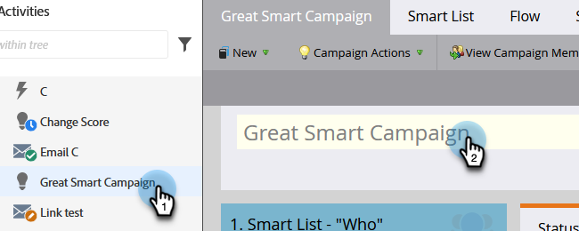

# Renommer une campagne intelligente {#rename-a-smart-campaign}

Vous pouvez modifier le nom d’une campagne dynamique existante. Voici comment faire.

1. Accédez à **[!UICONTROL Activités marketing]**.

   

1. Sélectionnez votre campagne intelligente, puis cliquez sur son nom sur la droite.

   

   >[!TIP]
   >
   >Les noms de campagnes intelligentes dans les programmes sont toujours traduits au format « ProgramName.CampaignName ».

1. Saisissez le nouveau nom de la campagne dynamique et cliquez sur **[!UICONTROL Enregistrer]**.

   

   >[!NOTE]
   >
   >L’ancien nom est visible dans l’onglet et il change lors de l’enregistrement.

Rapide et facile ! Tout emplacement de référence de la campagne dynamique est également modifié.
