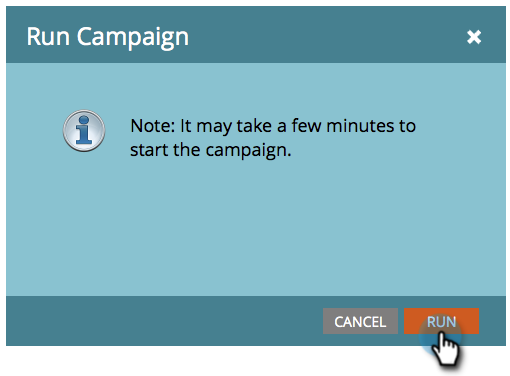

# Exécuter immédiatement une campagne intelligente par lots | Onglet Planning {#run-a-batch-smart-campaign-now-schedule-tab}

Une fois la création de la campagne par lots terminée, vous pouvez choisir de l’exécuter maintenant ou plus tard.

1. Sélectionnez la campagne par lots, accédez à l’onglet **[!UICONTROL Planning]**, puis cliquez sur **[!UICONTROL Exécuter une fois]**.

   

1. Assurez-vous que **[!UICONTROL Exécuter maintenant]** est sélectionné et cliquez sur **[!UICONTROL Exécuter]**.

   

1. Confirmez en cliquant une nouvelle fois sur **[!UICONTROL Exécuter]**.

   

   Vous pouvez également [planifier des exécutions pour plus tard](/help/marketo/product-docs/core-marketo-concepts/smart-campaigns/using-smart-campaigns/schedule-a-batch-smart-campaign-to-run-later.md){target="_blank"} si vous le souhaitez.

   >[!NOTE]
   >
   >* [Planifier l’exécution ultérieure d’une campagne intelligente par lots](/help/marketo/product-docs/core-marketo-concepts/smart-campaigns/using-smart-campaigns/schedule-a-batch-smart-campaign-to-run-later.md){target="_blank"}
   >* [Planifier une campagne par lots récurrente](/help/marketo/product-docs/core-marketo-concepts/smart-campaigns/using-smart-campaigns/schedule-a-recurring-batch-campaign.md){target="_blank"}
