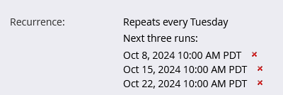

# Planification d’une campagne par lots récurrente {#schedule-a-recurring-batch-campaign}

La périodicité permet d’exécuter une campagne par lots selon un calendrier régulier. Par exemple : une fois par semaine, le mardi à 10h00.

1. Sélectionnez la campagne dynamique, accédez au **Planification** , puis cliquez sur **Périodicité du planning**.

   

1. Cliquez sur le bouton **Planification** et sélectionnez **Hebdomadaire**.

   

1. Cliquez sur l’icône du calendrier et sélectionnez le jour de votre choix pour la première exécution.

   

1. Sélectionnez l’heure à laquelle il doit s’exécuter.

   

1. Laissez Répéter toutes les fois, sélectionnez Mardi, puis cliquez sur **Enregistrer**.

   

   >[!NOTE]
   >
   >Pour une durée d’exécution spécifique, vous pouvez cliquer sur l’icône de calendrier en regard de **Fin le** et choisissez la date de fin.

Les récurrences planifiées sont affichées au bas de l&#39;onglet Planning .

>[!NOTE]
>
>L’onglet Planning affiche les trois occurrences suivantes à titre de référence. Cliquer sur le rouge **X** annule cette exécution spécifique.
