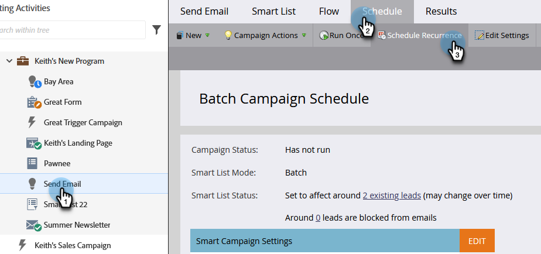

# Planification d’une campagne par lots récurrente {#schedule-a-recurring-batch-campaign}

La périodicité permet d’exécuter une campagne par lots selon un calendrier régulier. Par exemple : une fois par semaine, le mardi à 10h00.

1. Sélectionnez la campagne dynamique, accédez à l’onglet **[!UICONTROL Planning]**, puis cliquez sur **[!UICONTROL Périodicité du planning]**.

   

1. Cliquez sur la liste déroulante **[!UICONTROL Planning]** et sélectionnez **[!UICONTROL Hebdomadaire]**.

   

1. Cliquez sur l’icône du calendrier et sélectionnez le jour de votre choix pour la première exécution.

   

1. Sélectionnez l’heure à laquelle il doit s’exécuter.

   

1. Laissez &quot;[!UICONTROL Répéter toutes les]&quot; sur 1, sélectionnez Mardi et cliquez sur **[!UICONTROL Enregistrer]**.

   

   >[!NOTE]
   >
   >Pour une durée d’exécution spécifique, vous pouvez cliquer sur l’icône de calendrier en regard de **[!UICONTROL Expire le]** et choisir la date de fin.

Les récurrences planifiées sont affichées au bas de l&#39;onglet Planning .

>[!NOTE]
>
>L’onglet Planning affiche les trois occurrences suivantes à titre de référence. Cliquez sur le caractère rouge **X** pour annuler cette exécution spécifique.
