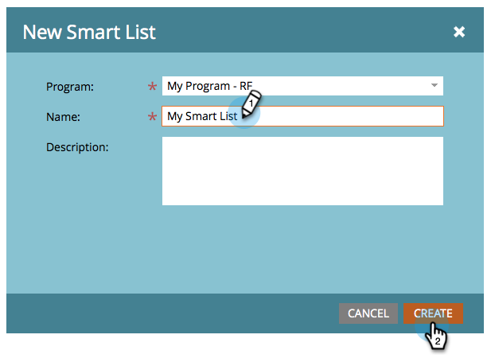

# Création d’une liste dynamique {#create-a-smart-list}

Les listes dynamiques vous permettent de trouver des groupes de personnes spécifiques à l’aide de filtres simples. Voici comment en créer un.

1. Accédez à **[!UICONTROL Activités marketing]**.

   

1. Sélectionnez le programme dans lequel vous souhaitez créer la liste dynamique.

   

1. Sous **[!UICONTROL New]**, cliquez sur **[!UICONTROL New Local Asset]**.

   

1. Sélectionnez **[!UICONTROL Liste dynamique]**.

   

1. Saisissez un **[!UICONTROL Nom]** et cliquez sur **[!UICONTROL Créer]**.

   

   Ta-da, super boulot ! Maintenant, ajoutons et définissez des filtres.

   >[!MORELIKETHIS]
   >
   >[Rechercher et ajouter des filtres à une liste dynamique](/help/marketo/product-docs/core-marketo-concepts/smart-lists-and-static-lists/creating-a-smart-list/find-and-add-filters-to-a-smart-list.md){target="_blank"}
