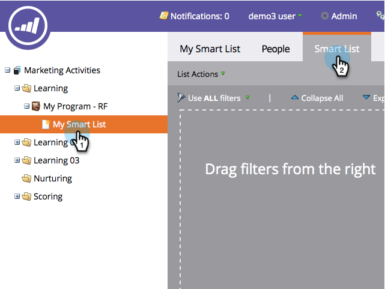

# Rechercher et Ajouter des Filtres à une Liste intelligente {#find-and-add-filters-to-a-smart-list}

Une fois que vous avez [créé une liste](create-a-smart-list.md)intelligente, vous devez ajouter et [définir](define-smart-list-filters.md) des filtres. Voici comment trouver et ajouter des filtres.

Dans cet exemple, recherchons toutes les personnes en Californie avec un score supérieur à 50.

>[!NOTE]
>
>**FYI**
>
>Marketo est maintenant en train de normaliser la langue dans tous les abonnements. Vous pouvez donc voir des pistes dans votre abonnement et des personnes/personnes dans docs.marketo.com. Ces termes signifient la même chose ; cela n&#39;a aucune incidence sur les instructions relatives aux articles. Il y a aussi d&#39;autres changements. [En savoir plus](http://docs.marketo.com/display/DOCS/Updates+to+Marketo+Terminology).

>[!TIP]
>
>Explorez l&#39;arbre à droite - les filtres sont très puissants et ont une grande variété de fonctions possibles.

1. Accédez à Activités **** marketing.

   

1. Sélectionnez la liste dynamique à laquelle vous souhaitez ajouter des filtres, puis cliquez sur l’onglet Liste **** intelligente.

   

1. Recherchez et faites glisser le filtre **Etat** sur la trame.

   

1. Recherchez également et faites glisser le filtre **Note** sur.

   

Parfait ! Allons de l&#39;avant et définissons ces filtres.

>[!NOTE]
>
>**Articles connexes**
>
>* [Création d’une Liste dynamique](create-a-smart-list.md)
>* [Définir des Filtres de Liste intelligente](define-smart-list-filters.md)

>

