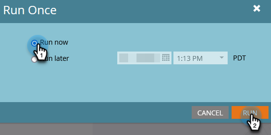

# Ajouter une personne à la Liste bloquée {#add-person-to-blocklist}

L’ajout de personnes à votre Liste bloquée les empêche de recevoir votre correspondance.

1. Créez un [programme par défaut](/help/marketo/product-docs/core-marketo-concepts/programs/creating-programs/create-a-program.md){target="_blank"} et nommez-le &quot;Ajouter à la Liste bloquée&quot;.

1. Cliquez sur **[!UICONTROL New]** et sélectionnez **[!UICONTROL New Local Asset]**.

   

1. Sélectionnez **[!UICONTROL Liste dynamique]**.

   

1. Nommez votre liste et cliquez sur **[!UICONTROL Créer]**.

   

1. Ajoutez toutes les personnes à votre liste dynamique que vous souhaitez ajouter à votre Liste bloquée.

   

   >[!NOTE]
   >
   >Les personnes de votre Liste bloquée ne recevront pas d’e-mails opérationnels.

1. Revenez à votre programme.

   

1. Cliquez sur **[!UICONTROL New]** et sélectionnez **[!UICONTROL New Smart Campaign]**.

   

1. Nommez la nouvelle campagne dynamique. Cliquez sur **[!UICONTROL Créer]**.

   

1. Effectuez un glisser-déposer de **[!UICONTROL Member of Smart List]**.

   

1. Sélectionnez la liste dynamique que vous venez de créer.

   

1. Cliquez sur l’onglet **[!UICONTROL Flux]** . Faites glisser et déposez l’action Flux **[!UICONTROL Modifier la valeur de données]**.

   

1. Dans la liste déroulante **[!UICONTROL Attribute]** , sélectionnez **[!UICONTROL Block Listed]** et définissez **[!UICONTROL New Value]** sur **[!UICONTROL true]**.

   

1. Cliquez sur l’onglet **[!UICONTROL Planning]** et sélectionnez **[!UICONTROL Exécuter une fois]**.

   

1. Sélectionnez **[!UICONTROL Run Now]** et cliquez sur **[!UICONTROL Run]**.

   

1. Cliquez de nouveau sur **[!UICONTROL Exécuter]**.

   

Ces personnes ne recevront plus d’e-mails.

>[!TIP]
>
>Créez une [campagne de déclenchement](/help/marketo/product-docs/core-marketo-concepts/smart-campaigns/creating-a-smart-campaign/create-a-new-smart-campaign.md){target="_blank"} à l’aide de **Modifier la valeur des données** avec **La liste bloquée est vraie** pour toutes les personnes qui, à l’avenir, auront des attributs pouvant bénéficier d’une liste bloquée.
