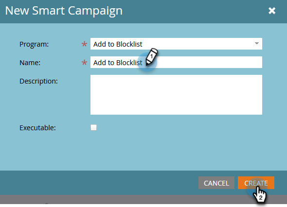

# Ajouter une personne à la Liste bloquée {#add-person-to-blocklist}

L’ajout de personnes à votre Liste bloquée les empêche de recevoir votre correspondance.

1. [Créer un programme par défaut](/help/marketo/product-docs/core-marketo-concepts/programs/creating-programs/create-a-program.md) et nommez-le **Ajouter à la Liste bloquée**.

1. Cliquez sur **Nouveau** et sélectionnez **Nouvelle ressource locale**.

   

1. Sélectionner **Liste dynamique**.

   

1. Nommez votre liste et cliquez sur **Créer**.

   

1. Ajoutez toutes les personnes à votre **Liste dynamique** vous voulez être ajouté à votre Liste bloquée.

   

   >[!NOTE]
   >
   >Les personnes de votre Liste bloquée ne recevront pas d’e-mails opérationnels.

1. Revenez à votre programme.

   

1. Cliquez sur **Nouveau** et sélectionnez **Nouvelle campagne dynamique**.

   

1. Attribuez un nom au **Nouvelle campagne dynamique**. Cliquez sur **Créer**.

   

1. Glisser-déposer **Membre de la liste dynamique**.

   

1. Sélectionnez la liste dynamique que vous venez de créer.

   

1. Cliquez sur l&#39;onglet **Flux.** Faites glisser et déposez le **Modifier la valeur des données** Action de flux.

   

1. Dans le **Attribut** menu déroulant **Liste bloquée** et défini **Nouvelle valeur** to **true**.

   

1. Cliquez sur le bouton **Planification** et sélectionnez **Exécuter une fois**.

   

1. Sélectionner **Exécuter maintenant** et cliquez sur **Exécuter**.

   

1. Cliquez sur **Exécuter** encore une fois.

   

Ces personnes ne recevront plus d’e-mails.

>[!TIP]
>
>Créez un [déclencher une campagne dynamique](/help/marketo/product-docs/core-marketo-concepts/smart-campaigns/creating-a-smart-campaign/create-a-new-smart-campaign.md) using **Modifier la valeur des données** avec **La liste bloquée est vraie** pour toutes les personnes qui, à l’avenir, auront des attributs qui leur permettront de placer sur la liste bloquée.
