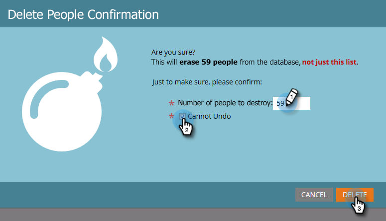

# Supprimer des personnes dans une Liste ou une Liste intelligente {#delete-people-in-a-smart-list-or-list}

Vous pouvez supprimer rapidement et facilement certaines/toutes les personnes qui se trouvent dans une liste ou une liste intelligente.

>[!PREREQUISITES]
>
>[Création d’une Liste dynamique](/help/marketo/product-docs/core-marketo-concepts/smart-lists-and-static-lists/creating-a-smart-list/create-a-smart-list.md)

1. Accédez à **Activités marketing**.

   

1. Sélectionnez la liste/liste intelligente qui contient toutes les personnes à supprimer et accédez à l&#39;onglet **Personnes**.

   

   >[!CAUTION]
   >
   >Lorsque vous supprimez une personne, vous ne la supprimez pas seulement de la liste, elle sera complètement supprimée de la base de données.

1. Cliquez sur **Sélectionner tout**. Vous pouvez également sélectionner quelques enregistrements manuellement en utilisant Ctrl/Cmd et en cliquant sur.

   

   >[!NOTE]
   >
   >Si les résultats s’étendent sur plusieurs pages, cliquez sur **Sélectionner tout** pour sélectionner toutes les personnes sur toutes les pages.

1. Pour supprimer complètement les personnes de Marketo, cliquez sur **Supprimer la personne**.

   

1. Définissez **Supprimer de CRM** sur **true** si vous souhaitez supprimer également les enregistrements de votre CRM.

   

   >[!CAUTION]
   >
   >La suppression de Marketing Cloud et de votre gestion de la relation client signifie que vous ne pourrez jamais récupérer dans aucun des systèmes. Les gens et leur histoire seront partis pour toujours. Si vous les rajoutez plus tard, ils seront traités comme des enregistrements flambant neufs.

   >[!NOTE]
   >
   >Si votre Marketo n’est pas lié à votre CRM, l’option est grisée comme dans la capture d’écran.

1. Cliquez sur **Exécuter maintenant**.

   

1. Si vous supprimez plus de 50 personnes, vous verrez ceci. Tapez le nombre de personnes que vous supprimez, cochez la case **Impossible d&#39;annuler**, puis cliquez sur **Supprimer**.

   

   >[!NOTE]
   >
   >Pour vue les résultats de la suppression en masse, cliquez sur **Résultats de la Vue** dans la fenêtre contextuelle Action de flux unique située dans le coin supérieur droit de l’écran. Les heures de suppression peuvent varier considérablement en fonction de plusieurs facteurs.

   C&#39;est une bonne fonctionnalité, il faut être très prudent quand on l&#39;utilise !
