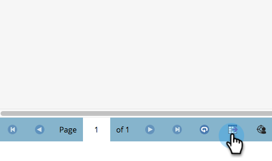

# Exportation de personnes vers Excel à partir d’une liste ou d’une liste dynamique {#export-people-to-excel-from-a-list-or-smart-list}

Si vous avez besoin de résultats de liste ou de liste dynamique en dehors de Marketo, vous pouvez facilement les exporter vers Excel. Voici comment.

1. Accédez à **[!UICONTROL Activités marketing]**.

   

1. Sélectionnez la liste ou la liste dynamique à exporter et accédez à l’onglet **[!UICONTROL Personnes]**.

   

1. En bas de la page, cliquez sur l’icône Excel.

   

1. Sélectionnez **[!UICONTROL Colonnes visibles]** et cliquez sur **[!UICONTROL Exporter]**.

   

   >[!NOTE]
   >
   >Si vous choisissez **[!UICONTROL Toutes les colonnes]**, la taille de l’exportation sera plus importante et la génération/le téléchargement prendra plus de temps.

   >[!TIP]
   >
   >Si vos enregistrements de personne contiennent des caractères étrangers qui ne sont pas correctement rendus lors de l’exportation, essayez de modifier le type de fichier dans la liste déroulante **[!UICONTROL Format]**.

1. L’exportation s’exécute. Une fois que vous avez terminé, vous pouvez cliquer sur **[!UICONTROL Télécharger maintenant]** pour attraper le fichier.

   

   >[!TIP]
   >
   >Si l’exportation prend du temps, vous pouvez toujours vous déconnecter et y revenir ultérieurement. Le lien **[!UICONTROL Télécharger maintenant]** est accessible en sélectionnant **[!UICONTROL Afficher l’état d’exportation]** dans le menu **[!UICONTROL Actions de liste]** et est valide pendant une semaine.
